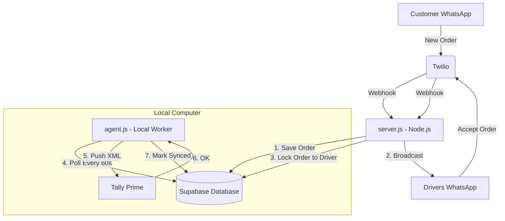

# Technical Deep-Dive: Tally-WhatsApp Dispatch System

This document provides a highly detailed explanation of the logic and data flow within your system.

---

## 🏗️ 1. The Component Roles

### ☁️ Cloud Layer ([server.js](file:///c:/Users/20fe1/OneDrive/tally-orders-server/server.js) + Supabase)
The Cloud Layer is the **"System of Record"**. It is always online and acts as the gatekeeper for all incoming data.
*   **Twilio Webhooks**: Every time a driver or customer sends a message, Twilio hits an endpoint in [server.js](file:///c:/Users/20fe1/OneDrive/tally-orders-server/server.js).
*   **Order State Machine**: [server.js](file:///c:/Users/20fe1/OneDrive/tally-orders-server/server.js) moves an order through these states:
    1.  `searching`: Order created, broadcast sent to drivers.
    2.  `accepted`: A driver claimed it. All other drivers are "locked out".
    3.  `delivered`: Driver confirmed drop-off.
    4.  `payment_recorded`: Driver selected Cash/UPI. 
*   **Why Supabase?**: We use Supabase instead of a local database because you might have 10 drivers across the city. They all need to see the same "Truth" at the same millisecond to ensure two people don't take the same order.

---

## 🔄 2. The Critical Workflows

### 🏎️ Workflow A: The "First-to-Claim" Race
This is the most complex logic in [server.js](file:///c:/Users/20fe1/OneDrive/tally-orders-server/server.js). 
1.  **Broadcast**: When a customer orders, [server.js](file:///c:/Users/20fe1/OneDrive/tally-orders-server/server.js) loops through [drivers.json](file:///c:/Users/20fe1/OneDrive/tally-orders-server/drivers.json) and sends a notification to *all* active drivers.
2.  **The Claim**: When Driver A replies "1" (Accept):
    *   [server.js](file:///c:/Users/20fe1/OneDrive/tally-orders-server/server.js) runs a database query to find an order where `order_status = 'searching'` AND `id = X`.
    *   If it finds it, it immediately updates that row to `order_status = 'accepted'` and writes `driver_phone = DriverA`.
    *   **The Lock**: If Driver B replies "1" just a half-second later, the same query will return **ZERO results** (because the status is no longer `searching`).
3.  **The Result**: Driver A gets a "Success" message; Driver B gets an "Already Claimed" message. This prevents double-deliveries.

### 🤖 Workflow B: The Tally Sync Protocol ([agent.js](file:///c:/Users/20fe1/OneDrive/tally-orders-server/tally-agent/agent.js))
Since Tally Prime doesn't have a built-in Cloud API, [agent.js](file:///c:/Users/20fe1/OneDrive/tally-orders-server/tally-agent/agent.js) acts as a **Local Bridge**.
1.  **The Search**: Every minute, [agent.js](file:///c:/Users/20fe1/OneDrive/tally-orders-server/tally-agent/agent.js) asks Supabase for orders where `delivered = true` AND `tally_synced = false`.
2.  **The Conversion**: It takes the Order ID, Qty, and Price and converts them into a specific **XML Format** that Tally understands.
3.  **The Local Push**: It sends an HTTP POST request to `http://localhost:9000` (Tally's internal port).
4.  **Verification**: 
    *   It parses Tally's response. 
    *   If Tally says "Created: 1", the agent tells Supabase: `"MARK AS SYNCED"`.
    *   This ensures that no order is ever double-entered in Tally, even if the computer restarts.

---

## 🛠️ 3. Data Structure Overview

### [drivers.json](file:///c:/Users/20fe1/OneDrive/tally-orders-server/drivers.json) (The Configuration)
This is the only file you manually edit. It controls:
*   `active: true/false`: If a driver goes on leave, change this to `false` and they will stop receiving broadcasts immediately.
*   `phone`: Must include `whatsapp:+91...` for Twilio to find them.

### Supabase Table (`orders`)
Key columns we track:
*   `customer_phone`: Who ordered.
*   `address`: Extracted via our custom regex parser.
*   `driver_phone`: Who is delivering it.
*   `payment_mode`: "Cash" or "UPI" (used for the narration in Tally).
*   `tally_synced`: A boolean flag used by [agent.js](file:///c:/Users/20fe1/OneDrive/tally-orders-server/tally-agent/agent.js) to track its progress.

---

## 🧩 4. Visual Architecture

---

## 🛡️ 5. Reliability Design
*   **Restart-Proof**: If [server.js](file:///c:/Users/20fe1/OneDrive/tally-orders-server/server.js) crashes, the orders are already in Supabase. Once it restarts, it picks up exactly where it left off.
*   **Offline Support**: If Tally is closed for 2 days, [agent.js](file:///c:/Users/20fe1/OneDrive/tally-orders-server/tally-agent/agent.js) will wait. When you open Tally, it will instantly sync all accumulated orders from the past 48 hours in one shot.
*   **Privacy**: Your Tally data stays on your computer. Only the specific order info (Customer name and price) is stored in the database.

Does this deeper technical overview give you the clarity you were looking for? 🚚💨🌊
